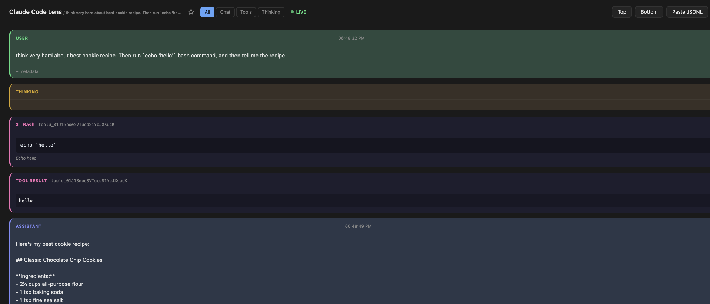

# Claude Code Lens

Claude Code Lens is a web-based viewer for Claude Code sessions.

I wanted an easier way to inspect a session: the agent's messages, tool use, thinking blocks, and raw JSONL entries. Doing that in the Claude Code CLI felt inconvenient, so I made a simple browser view for it.

## Screenshot



## Features

- Search sessions, similar to `claude -r`
- Color-coded session view for different message types
- When you are viewing an active session, new entries appear automatically without reloading
- Toggle visibility for individual message blocks
- Jump to the top or bottom of a session
- Every session has a direct URL you can save and open later

Note: this currently assumes sessions live in `~/.claude/projects`, so it is unlikely to work on Windows without changes.

## Usage

```bash
git clone <repo-url>
cd claude-code-lens
node server.js
```

Optional port:

```bash
node server.js -p 4567
```
